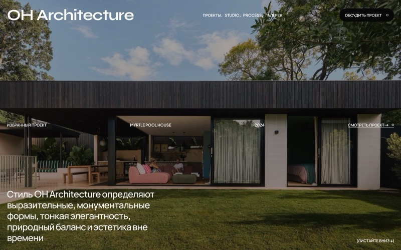
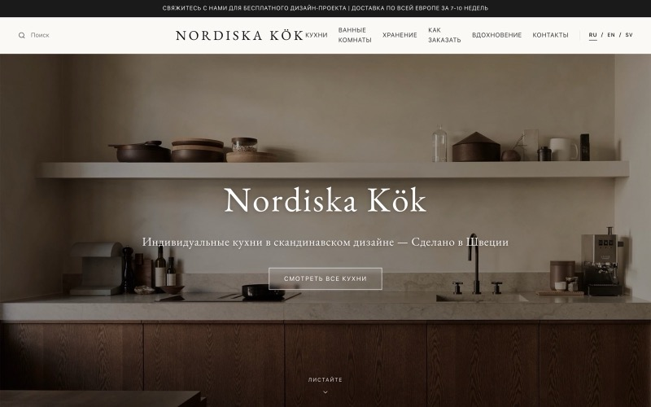
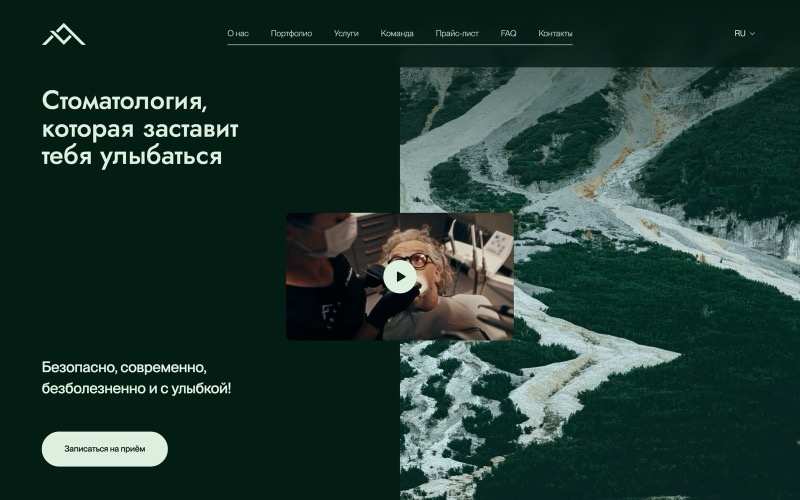
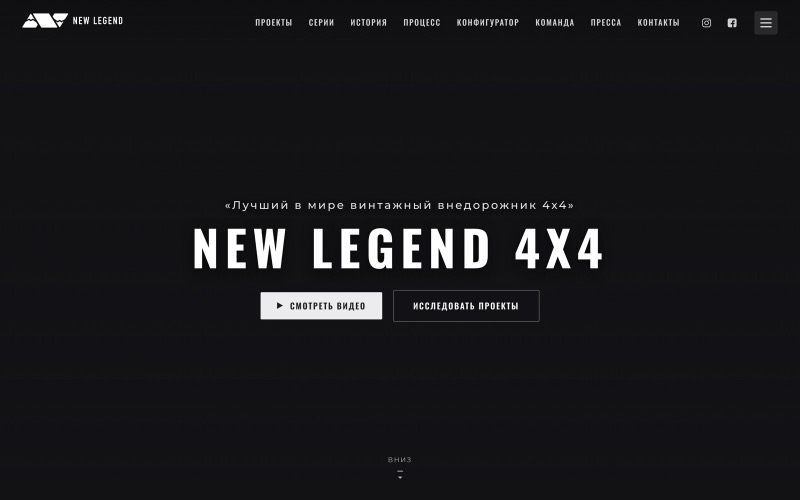
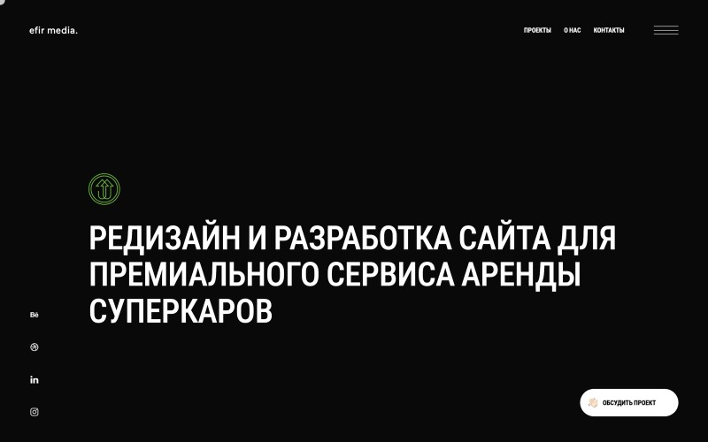

<h1 align="center">Fedor Shevtsov</h1>

  Конверсионные сайты, веб-сервисы и AI-автоматизации. 
  От брифа до продакшена — стратегия, интерфейс, бэкенд и интеграции в одном процессе.

  <a href="https://nyraflow.ru"><b>nyraflow.ru</b></a> &nbsp;·&nbsp;
  <a href="https://t.me/nyraflow"><b>@nyraflow</b></a>

---

### Работы

<table>
  <tr>
    <td width="33%">
      
      <b>OH Architecture</b> 
      Архитектурное бюро
    </td>
    <td width="33%">
      
      <b>Nordiska Kök</b> 
      Скандинавские кухни
    </td>
    <td width="33%">
      
      <b>LAVA dental studio</b> 
      Стоматология
    </td>
  </tr>
  <tr>
    <td width="33%">
      
      <b>Skin Laundry</b> 
      Сеть клиник лазерного ухода
    </td>
    <td width="33%">
      
      <b>New Legend 4x4</b> 
      Кастомные рестомоды
    </td>
    <td width="33%">
      
      <b>Ultraviolet Way</b> 
      Диджитал-продакшн
    </td>
  </tr>
</table>

<a href="https://nyraflow.ru">Ещё работы на nyraflow.ru →</a>

---

### Код

**[nyraflow](https://github.com/Kaaai69/nyraflow)** — экосистема студии: лендинг, Telegram Mini App и автоматизация на n8n. Три приложения делят один сервер, но собираются раздельно, поэтому границы между ними описаны явно.
`Next.js` `TypeScript` `PostgreSQL` `Docker` `Caddy` `n8n`

**[ClientParserMap](https://github.com/Kaaai69/ClientParserMap)** — поиск потенциальных клиентов: компании из Google Places, 2GIS и OpenStreetMap, дедупликация, проверка сайтов, скоринг, выгрузка в Google Sheets. PostgreSQL — единственный источник истины, Redis/RQ обслуживает фоновый воркер.
`Python` `FastAPI` `SQLAlchemy async` `PostgreSQL` `Redis/RQ` `Alembic` `Docker`

**[TransurfMobileApp](https://github.com/Kaaai69/TransurfMobileApp)** — Android-first приложение привычек и рутин.
`Expo SDK 54` `React Native` `Expo Router` `Drizzle ORM` `strict TypeScript`

**[BitrixIntegration](https://github.com/Kaaai69/BitrixIntegration)** — Telegram-бот, который собирает данные в чате и создаёт сделки в Bitrix24.
`Python` `aiogram` `Bitrix24 REST API`

**[Bitrix2](https://github.com/Kaaai69/Bitrix2)** — выгрузка Bitrix24 в SQLite: 14 таблиц CRM, чатов и задач для аналитики и миграции.
`Python` `Bitrix24 REST API` `SQLite`

---

### Хакатоны

**Департамент финансов города Москвы** — «Финик», виртуальный питомец, который учит детей 7–12 лет обращаться с деньгами. Ребёнок распределяет ограниченный доход между тремя конвертами — обязательные расходы, желания и накопления, — а питомец растёт не от трат, а от финансового здоровья хозяина. Механики смаплены на Единую рамку финансовой грамотности. Android/RuStore, Kotlin + Compose.

---

### Стек

**Фронтенд** Next.js · React · TypeScript · Tailwind · Playwright
**Бэкенд** Python · FastAPI · SQLAlchemy · PostgreSQL · Redis/RQ · Alembic
**Мобайл** React Native · Expo · Drizzle ORM
**Инфраструктура** Docker · Caddy · n8n · GitHub Actions
**Интеграции** Bitrix24 · Telegram Bot API · Google Places · 2GIS · OpenStreetMap · Google Sheets

   
  <a href="https://t.me/nyraflow"><b>Telegram @nyraflow</b></a> &nbsp;·&nbsp;
  <a href="https://nyraflow.ru"><b>nyraflow.ru</b></a>

